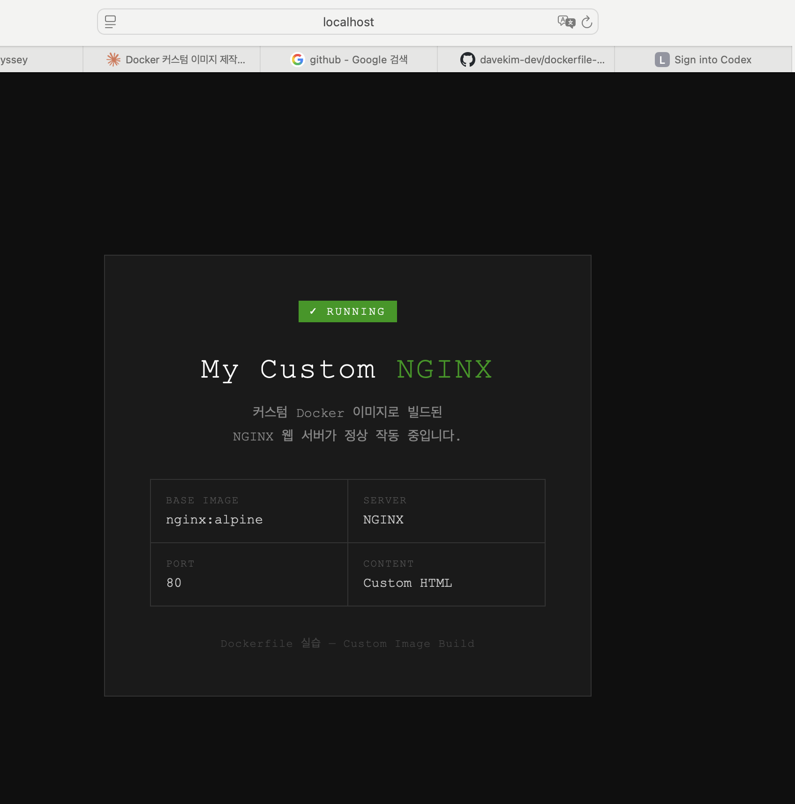
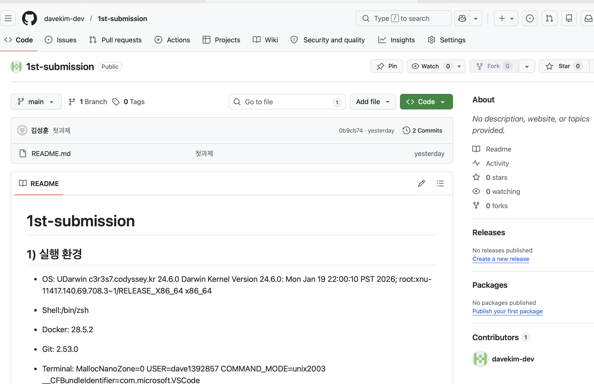

# 1st-submission

 ## 1) 프로젝트 개요 (미션 요약)
이 미션의 최종 결과물은 GitHub 공개 저장소 하나로 모든 산출물을 확인할 수 있는 개발 워크스테이션 구축 결과물입니다. 
저장소에는 프로젝트 개요, 실행 환경, 수행 항목 체크리스트, 검증 방법, 트러블슈팅 2건 이상을 포함한 README.md 기술 문서를 작성합니다. 
터미널에서 수행한 핵심 명령과 출력 결과, Docker 설치·운영·검증 로그도 문서에 함께 기록합니다. Dockerfile 기반 웹 서버 컨테이너를 구성하고, 빌드·실행 결과 및 포트 매핑을 통한 브라우저 접속 화면(주소창 포함)을 첨부합니다. 
바인드 마운트를 통한 호스트 변경 전/후 비교, Docker 볼륨을 통한 컨테이너 삭제 전/후 데이터 영속성 검증 결과도 포함합니다. 
마지막으로 Git 사용자 정보 설정과 VSCode에서의 GitHub 로그인 및 저장소 연동 완료 증거를 함께 제출합니다.

 ## 2) 실행 환경
- OS: 
```bash
$ uname -a
Darwin c3r3s7.codyssey.kr 24.6.0 Darwin Kernel Version 24.6.0: Mon Jan 19 22:00:10 PST 2026; root:xnu-11417.140.69.708.3~1/RELEASE_X86_64 x86_64
```

- Shell:
```bash
$ echo$SHELL
/bin/zsh
```
- Docker: 
```bash
$ docker --version
Docker version 28.5.2, build ecc6942
```
- Git: 
```bash
$ git --version
git version 2.53.0
```

- Terminal:
```bash
$ printenv
 MallocNanoZone=0
USER=dave1392857
COMMAND_MODE=unix2003
__CFBundleIdentifier=com.microsoft.VSCode
```
- 


## 3) 수행 체크리스트
- [x] 터미널 기본 조작 및 폴더 구성
- [x] 권한 변경 실습   
- [x] Docker 설치/점검
- [x] hello-world 실행
- [x] Dockerfile 빌드/실행
- [x] 포트 매핑 접속(2회)
- [x] 바인드 마운트 반영
- [x] 볼륨 영속성
- [x] Git 설정 + VSCode GitHub 연동


## 4) 터미널 조작 로그
 1. 현재 위치 확인 : pwd
 ```bash
 $ pwd
/Users/dave1392857/practice/1st-submission
```

 2. 목록 확인: ls(파일만) ls -l(파일 권한) ls -la(숨김 파일)
```bash
$ ls

1st-submission  README.md
```
```bash
$ ls -l

total 8
drwxr-xr-x  5 dave1392857  dave1392857   160 Apr 10 19:30 1st-submission
-rw-r--r--  1 dave1392857  dave1392857  4013 Apr  9 21:45 README.md
```
```bash
$ls -la

otal 8
drwxr-xr-x   5 dave1392857  dave1392857   160 Apr 10 19:31 .
drwxr--r--   5 dave1392857  dave1392857   160 Apr  9 21:41 ..
drwxr-xr-x  14 dave1392857  dave1392857   448 Apr  9 21:50 .git
drwxr-xr-x   5 dave1392857  dave1392857   160 Apr 10 19:30 1st-submission
-rw-r--r--   1 dave1392857  dave1392857  4013 Apr  9 21:45 README.md
```

 3. 이동: mv 파일명.txt 새경로/파일.txt.    , (상위로 이동) mv 파일명.txt ../파일명.txt
 ```bash
#하위 폴더로 이동
$ 1% ls   
2       a

$ mv a 2/a

$ 1% ls
2
 ```
 ```bash
 #상위 폴더로 이동
$ 2 % ls
3       a

$ 2 % mv a ../a

$ 1 % ls
2       a
```


 4. 이름변경: mv 옛이름.txt 새이름.txt
 ```bash
# a => b
2       a

$ 1 % mv a b

$ 1% ls
2       b
 ```

 5. 폴더 생성: mkdir 폴더명   / (상위-하위) mkdir -p 이름1/이름2 .. 

 ```bash
 $ mkdir -p 1/2/3
dave1392857@c3r3s7 practice % ls
1               1st-submission
```
```bash
$ mkdir a
dave1392857@c3r3s7 1 % ls
2       a
```
 6. 파일 생성: touch 파일명.txt / (내용 담아서) echo 내용 > 파일명.txt
 ```bash
 #빈 파일
$ 1 % touch c
$ 1 % cat c
 ```
 ```bash
$ 1 % echo hi >d
$ 1 % cat d
hi
 ```
 7. 삭제: (파일 삭제) rm 파일명.txt.  /  (폴더 삭제) rm -r 이름 ,   (하위도 같이 삭제) rm -r e
```bash
#파일 삭제
$ 1 % ls
2       b       c

$ 1 % rm c

$ 1 % ls
2       b
```
```bash
#폴더 삭제
$ 1 % ls
2       b

$ 1 % rm -r b

$ 1 % ls
2
```

 8. 복사: cp 파일명.txt 복사파일명.txt
 ```bash
$ 1 % echo hi > a

$ 1 % cp a 2/b
 
$ 2 % ls
3       b

$ 2 % cat b
hi
 ```

## 5) 권한 실습
1. 권한 실습: r(read)/ w(write) / x(excute)
```bash
#권한 표기 확인
$ls -l 
$stat '파일명'

$stat b
16777220 1945074 -rw-r--r-- 1 dave1392857 dave1392857 0 3 "Apr 10 20:29:21 2026" "Apr 10 20:29:20 2026" "Apr 10 20:29:20 2026" "Apr 10 20:29:20 2026" 4096 8 0 b

$stat -f "%Sp %p" b
-rw-r--r-- 100644  
#100= 일반파일 / 040=폴더
```
```bash
#권한 변경
$ chmod 744 b

$ stat -f "%Sp %p" b
-rwxr--r-- 100744
```

## 6) Docker 운영/검증 로그
1. 설치 및 점검 결과
```bash
$docker --version
Docker version 28.5.2, build ecc6942

$docker info
Client:
 Version:    28.5.2
 Context:    orbstack
 Debug Mode: false
 Plugins:
  buildx: Docker Buildx (Docker Inc.)
    Version:  v0.29.1
    Path:     /Users/dave1392857/.docker/cli-plugins/docker-buildx
  compose: Docker Compose (Docker Inc.)
    Version:  v2.40.3
    Path:     /Users/dave1392857/.docker/cli-plugins/docker-compose

Server:
 Containers: 0
  Running: 0
  Paused: 0
  Stopped: 0
 Images: 0
```
2. 기본 운영 명령 수행
```bash
#1. docker 컨테이너 실행 전
$docker ps -a
CONTAINER ID   IMAGE     COMMAND   CREATED   STATUS    PORTS     NAMES

$docker ps
CONTAINER ID   IMAGE     COMMAND   CREATED   STATUS    PORTS     NAMES

$docker logs
docker: 'docker logs' requires 1 argument
$docker stats
CONTAINER ID   NAME      CPU %     MEM USAGE / LIMIT   MEM %     NET I/O   BLOCK I/O   PIDS 
```

```bash
#2. docker 컨테이너 실행 후
$docker run -dit --name container ubuntu bash
Unable to find image 'ubuntu:latest' locally
latest: Pulling from library/ubuntu
689b91d88a0f: Pull complete 
Digest: sha256:84e77dee7d1bc93fb029a45e3c6cb9d8aa4831ccfcc7103d36e876938d28895b
Status: Downloaded newer image for ubuntu:latest
root@6d6bda9b72d8:/#  

$docker ps -a
CONTAINER ID   IMAGE     COMMAND       CREATED         STATUS         PORTS     NAMES
f26f462c8aec   ubuntu    "/bin/bash"   4 seconds ago   Up 4 seconds             container

$docker ps a
CONTAINER ID   IMAGE     COMMAND       CREATED          STATUS          PORTS     NAMES
f26f462c8aec   ubuntu    "/bin/bash"   48 seconds ago   Up 47 seconds             container

$docker logs container

$docker stats
CONTAINER ID   NAME        CPU %     MEM USAGE / LIMIT   MEM %     NET I/O         BLOCK I/O     PIDS 
f26f462c8aec   container   0.00%     856KiB / 15.67GiB   0.01%     1.26kB / 126B   3.67MB / 0B   1 
```


## 7) 컨테이너 실행 실습

1. 컨테이너 실행 (hello world)
```bash
$docker run hello-world

Unable to find image 'hello-world:latest' locally
latest: Pulling from library/hello-world
4f55086f7dd0: Pull complete 
Digest: sha256:452a468a4bf985040037cb6d5392410206e47db9bf5b7278d281f94d1c2d0931
Status: Downloaded newer image for hello-world:latest

Hello from Docker!
This message shows that your installation appears to be working correctly.

To generate this message, Docker took the following steps:
 1. The Docker client contacted the Docker daemon.
 2. The Docker daemon pulled the "hello-world" image from the Docker Hub.
    (amd64)
 3. The Docker daemon created a new container from that image which runs the
    executable that produces the output you are currently reading.
 4. The Docker daemon streamed that output to the Docker client, which sent it
    to your terminal.

To try something more ambitious, you can run an Ubuntu container with:
 $ docker run -it ubuntu bash

Share images, automate workflows, and more with a free Docker ID:
 https://hub.docker.com/

For more examples and ideas, visit:
 https://docs.docker.com/get-started/
```
2. ubuntu 컨테이너 실행 (ls, echo)
```bash
$docker run -it --name pass ubuntu bash

$root@5eaff8e5795c:/# ls
bin  boot  dev  etc  home  lib  lib64  media  mnt  opt  proc  root  run  sbin  srv  sys  tmp  usr  var

$root@5eaff8e5795c:/# echo hi>app
$root@5eaff8e5795c:/# ls  
app  bin  boot  dev  etc  home  lib  lib64  media  mnt  opt  proc  root  run  sbin  srv  sys  tmp  usr  var

$root@5eaff8e5795c:/# cat app
hi
```
3. attach & exec
백그라운드 컨테이너 실행 후 stat 확인
```bash
#1. attach 백그라운드 컨테이너 실행 후 stat 확인
$docker run -dit --name attach ubuntu

$docker attach attach

$root@6d07906df23e:/# exit
exit

$docker ps -a
CONTAINER ID   IMAGE         COMMAND       CREATED          STATUS                      PORTS     NAMES
6d07906df23e   ubuntu        "/bin/bash"   30 seconds ago   Exited (0) 3 seconds ago              attach
```
```bash
#2. exec 백그라운드 컨테이너 실행 후 stat 확인
$docker run -dit --name exec ubuntu

$dave1392857@c3r3s7 practice % docker exec -it exec bash

$root@7091eb03dbae:/#exit
exit

$docker ps -a
CONTAINER ID   IMAGE         COMMAND       CREATED          STATUS                      PORTS     NAMES
7091eb03dbae   ubuntu        "/bin/bash"   2 minutes ago    Up 2 minutes                          exec
```
- ==> attach 는 container PID 1(메인 프로세스)에 직접 연결

"exit = PID 1 종료" 

- ==> exec 는 container PID 2(bash)로 따로 연결 --- PID 1(메인 프로세스) 실행 중

"exit = bash 종료 / PID 1 실행"


- PID 1 접속 후 up 유지하기
```bash
#attach 접속 exit 하면서  up 상태 유지하기 
#1.단축키 (ctrl p + q)
$docker run -dit --name attach2 ubuntu
4df71753e9cd1502b8119f5c244b04d8812432c25ba144f72ad3d9c5ba89ef91

$docker attach --detach-keys="ctrl-d" attach2
#attach 후 변경 단축키(ctrl+d)

$ root@4df71753e9cd:/# read escape sequence

$docker ps -a
CONTAINER ID   IMAGE         COMMAND       CREATED          STATUS                            PORTS     NAMES
4df71753e9cd   ubuntu        "/bin/bash"   23 seconds ago   Up 22 seconds                               attach2
```


  ## 8) dockerfile 커스텀
  
  1. 웹 서비스 기반 dockerfile 생성
  ```bash
#1 정적 파일 설정
#2 nginx 설정 (내장되어 있는 내용을 변경 ex: port 설정)
#3 dockerfile 설치

$docker build -t custom_image-nginx:1.0 .

[+] Building 7.8s (8/8) FINISHED                                                                                                                                                                                              docker:orbstack
 => [internal] load build definition from Dockerfile                                                                                                                                                                                     0.2s
 => => transferring dockerfile: 305B                                                                                                                                                                                                     0.0s
 => [internal] load metadata for docker.io/library/nginx:alpine                                                                                                                                                                          2.7s
 => [internal] load .dockerignore                                                                                                                                                                                                        0.2s
 => => transferring context: 2B                                                                                                                                                                                                          0.0s
 => [1/3] FROM docker.io/library/nginx:alpine@sha256:582c496ccf79d8aa6f8203a79d32aaf7ffd8b13362c60a701a2f9ac64886c93d                                                                                                                    3.7s
 => => resolve docker.io/library/nginx:alpine@sha256:582c496ccf79d8aa6f8203a79d32aaf7ffd8b13362c60a701a2f9ac64886c93d                                                                                                                    0.2s
 => => sha256:582c496ccf79d8aa6f8203a79d32aaf7ffd8b13362c60a701a2f9ac64886c93d 10.33kB / 10.33kB                                                                                                                                         0.0s
 => => sha256:c1263cc56873d66f381fd07149aa0dc7244dd7c941334cd18473c46509f08465 2.50kB / 2.50kB                                                                                                                                           0.0s
 => => sha256:5bd7bd52e5bcab15a093466b90e37472b0d0c0081052522afb8924cbdaf15f56 12.32kB / 12.32kB                                                                                                                                         0.0s
 => => sha256:589002ba0eaed121a1dbf42f6648f29e5be55d5c8a6ee0f8eaa0285cc21ac153 3.86MB / 3.86MB                                                                                                                                           0.5s
 => => sha256:f03becc8ac15611cfcc421c977a5ba4d65456093570788523a4ba557689aa7f7 1.87MB / 1.87MB                                                                                                                                           0.9s
 => => sha256:15e759724ff67f262e38bb7c070af9d0b84f959f9b37fa966f68bf2f881a4b62 627B / 627B                                                                                                                                               0.8s
 => => extracting sha256:589002ba0eaed121a1dbf42f6648f29e5be55d5c8a6ee0f8eaa0285cc21ac153                                                                                                                                                0.1s
 => => sha256:ff9f59a6a62e9e9f29d7a84fb18865b45664d3f0d061eff7548bd61746dd101c 957B / 957B                                                                                                                                               1.1s
 => => sha256:a71873b303e8d75170b7ced2725b01b3ae15ad76f0d4eef16a49335821b6a0ef 404B / 404B                                                                                                                                               1.3s
 => => extracting sha256:f03becc8ac15611cfcc421c977a5ba4d65456093570788523a4ba557689aa7f7                                                                                                                                                0.1s
 => => sha256:34dfdd2ef1f920d0054dde2fc09ddc83ff8e71d05fadb79e2cab6e6234596f0a 1.21kB / 1.21kB                                                                                                                                           1.4s
 => => extracting sha256:15e759724ff67f262e38bb7c070af9d0b84f959f9b37fa966f68bf2f881a4b62                                                                                                                                                0.0s
 => => extracting sha256:ff9f59a6a62e9e9f29d7a84fb18865b45664d3f0d061eff7548bd61746dd101c                                                                                                                                                0.0s
 => => sha256:c8a2fa3a88d244a3f32dcbc9c1f7649c662661a28c624198ada43aa0b7598e7f 1.40kB / 1.40kB                                                                                                                                           1.6s
 => => extracting sha256:a71873b303e8d75170b7ced2725b01b3ae15ad76f0d4eef16a49335821b6a0ef                                                                                                                                                0.0s
 => => sha256:1165b869c51a1a0747d78cec8fab96c30156a979e51ecf2f91aa792e557d94a4 20.25MB / 20.25MB                                                                                                                                         2.1s
 => => extracting sha256:34dfdd2ef1f920d0054dde2fc09ddc83ff8e71d05fadb79e2cab6e6234596f0a                                                                                                                                                0.0s
 => => extracting sha256:c8a2fa3a88d244a3f32dcbc9c1f7649c662661a28c624198ada43aa0b7598e7f                                                                                                                                                0.0s
 => => extracting sha256:1165b869c51a1a0747d78cec8fab96c30156a979e51ecf2f91aa792e557d94a4                                                                                                                                                0.4s
 => [internal] load build context                                                                                                                                                                                                        0.2s
 => => transferring context: 3.12kB                                                                                                                                                                                                      0.0s
 => [2/3] COPY nginx/default.conf /etc/nginx/conf.d/default.conf                                                                                                                                                                         0.2s
 => [3/3] COPY html/ /usr/share/nginx/html/                                                                                                                                                                                              0.2s
 => exporting to image                                                                                                                                                                                                                   0.3s
 => => exporting layers                                                                                                                                                                                                                  0.2s
 => => writing image sha256:03c7da6d47670aac01cb1428c2478d7e07cc2cea2fbec1d68d84cc22424b09a0                                                                                                                                             0.0s
 => => naming to docker.io/library/custom_image-nginx:1.0                                                                                                                                                                                0.0s

#설치된 파일 확인
$docker images custom_image-nginx
REPOSITORY           TAG       IMAGE ID       CREATED          SIZE
custom_image-nginx   1.0       03c7da6d4767   35 seconds ago   62.2MB
  ```

```bash
#컨테이너 실행
$docker run -d -p 8080:80 --name image_container custom_image-nginx:1.0
ada181189833b48cb2f18f0cf74950092f7b18371802136a8e83e1ee3d3d8ea9

#브라우저에 'localhost:8080' 으로 진입
```


---------------------------------


2. Linux 기반 커스텀 이미지
- debian 기반 결정
- python & app.py 패키지
- image container 실행
- 사용자/환경변수/헬스체크

```bash
#1. debain 기반 결정
python 과 가장 어울리는 Linux
```
```bash
#2(1). python 설치
$cat > requirements.txt << 'EOF'
flask==3.0.0
gunicorn==21.2.0
EOF

$cat requirements.txt
flask==3.0.0
gunicorn==21.2.0
```
```bash
#2(2). app.py 설치
cat > app.py << 'EOF'
from flask import Flask

app = Flask(__name__)

@app.route('/')
def hello():
    return 'Hello, World!'

if __name__ == '__main__':
    app.run(host='0.0.0.0', port=5000)
EOF

$cat app.py
from flask import Flask
app = Flask(__name__)
@app.route('/')
def hello():
    return 'Hello, World!'
if __name__ == '__main__':
    app.run(host='0.0.0.0', port=5000)
```

```bash
#3 dockerfile 설치
$cat > Dockerfile << 'EOF'
FROM python:3.11-slim

WORKDIR /app

COPY requirements.txt .

RUN pip install --no-cache-dir -r requirements.txt

COPY . .

EXPOSE 5000

CMD ["python", "app.py"]
EOF

$cat dockerfile
FROM python:3.11-slim

WORKDIR /app

COPY requirements.txt .

RUN pip install --no-cache-dir -r requirements.txt

COPY . .

EXPOSE 5000

CMD ["python", "app.py"]
```

```bash
#4. image build
$docker build -t linux_base:1.0 .
[+] Building 10.1s (10/10) FINISHED     

$docker images
REPOSITORY           TAG       IMAGE ID       CREATED              SIZE
linux_base           1.0       c350b2f45443   About a minute ago   142MB
```
```bash
#5. container 실행
$docker run -d -p 8081:5000 --name linux_base-container linux_base:1.0
277076ca817b3eafbb689643823c52f62ebb96e82576540897f644011b446775

$curl http://localhost:8081
Hello, World!%         
```


 ## 9) 볼륨 영속성 예시


 1. volume 생성
 - docker 내부에 내용을 저장하는 것
```bash
$docker volume create mydata
mydata

$docker volume ls
DRIVER    VOLUME NAME
local     mydata
```

2. volume 연결 확인
-컨테이너를 바꿔도 docker 내부의 저장된 내용은 바뀌지 않음

```bash
#container 에 내용 저장

$docker run -dit --name container -v mydata:/app ubuntu bash
Unable to find image 'ubuntu:latest' locally
latest: Pulling from library/ubuntu
689b91d88a0f: Pull complete 
Digest: sha256:84e77dee7d1bc93fb029a45e3c6cb9d8aa4831ccfcc7103d36e876938d28895b
Status: Downloaded newer image for ubuntu:latest
99e41a8245d69e2b41ec05692c3c4a9a3bceb4f805cae3beb6fda4823f0629af

$root@99e41a8245d6:/# cd /app
$root@99e41a8245d6:/app# echo hi>a.txt
$root@99e41a8245d6:/app# ls
a.txt
$root@99e41a8245d6:/app# cat a.txt
hi


#container2에 내용 확인(볼륨 영속성)

$docker run -dit --name container2 -v mydata:/app ubuntu bash
2d166de71daf06106094f98824c4191dc18abf72e0ef86f6b459d9466c782f29

$docker exec -it container2 bash

$root@2d166de71daf:/# cd /app
$root@2d166de71daf:/app# ls
a.txt
$root@2d166de71daf:/app# cat a.txt
hi
```

- 바인드 마운트
```bash
#바인드 마운트 생성 (container:bind_test)
$docker run -dit --name bind_test -v/Users/dave1392857/1st-submission/docs:/app ubuntu
a6b7de07b61d77b800bc895a5852210a11f1a6c64a37b6aeb5c6a69bde266c17

#docker 내 파일 생성
$docker exec -it bind_test bash

$root@a6b7de07b61d:/# cd /app
$root@a6b7de07b61d:/app# ls  
github.png  image.png

$root@a6b7de07b61d:/app# echo hi>bind 

$root@a6b7de07b61d:/app# ls
bind  github.png  image.png

$root@a6b7de07b61d:/app# exit

#localhost 에서 파일 확인
$ls
bind            github.png      image.png

#새로운 컨테이너에서 확인(container:bind_test2)
$docker run -dit --name bind_test2 -v/Users/dave1392857/1st-submission/docs:/app ubuntu
ac2d2789e7d8a1a3fa69c1c4d62d70ec52127534dfa1ef3cbbf4e2d0694939a4

$root@ac2d2789e7d8:/# cd /app
$root@ac2d2789e7d8:/app# cat bind
hi

#localhost에서 파일 변경
$echo hello>bind
$cat bind
hello

$docker exec -it bind_test2 bash

$root@ac2d2789e7d8:/# cd /app
$root@ac2d2789e7d8:/app# cat bind
hello
```

## 10) github 연동



## 11) 트러블  슈팅
1. 컨테이너에 attach로 접속 후 stat up상태를 유지하며 나가려고 했는데 단축키(ctrl P + Q)가 안 먹혔다.
```bash
#단축키 전환 (ctrl +d)
$docker attach --detach-keys="ctrl-d" attach2

$root@4df71753e9cd:/# read escape sequence

$docker ps -a
CONTAINER ID   IMAGE         COMMAND       CREATED          STATUS                            PORTS     NAMES
4df71753e9cd   ubuntu        "/bin/bash"   23 seconds ago   Up 22 seconds                               attach2
```


2. docker logs 출력값 보기
```bash
# 실행 값 X >> 출력값 X
$docker run -dit --name container ubuntu 
$docker logs container

#ubuntu bash 안에서 실행된 것이 없기 때문에 출력값이 없음
```

```bash
# 실행 값 O >> 출력값O
$docker run -dit --name webserver nginx

$docker logs webserver
/docker-entrypoint.sh: /docker-entrypoint.d/ is not empty, will attempt to perform configuration
/docker-entrypoint.sh: Looking for shell scripts in /docker-entrypoint.d/
/docker-entrypoint.sh: Launching /docker-entrypoint.d/10-listen-on-ipv6-by-default.sh
10-listen-on-ipv6-by-default.sh: info: Getting the checksum of /etc/nginx/conf.d/default.conf
10-listen-on-ipv6-by-default.sh: info: Enabled listen on IPv6 in /etc/nginx/conf.d/default.conf
/docker-entrypoint.sh: Sourcing /docker-entrypoint.d/15-local-resolvers.envsh
/docker-entrypoint.sh: Launching /docker-entrypoint.d/20-envsubst-on-templates.sh
/docker-entrypoint.sh: Launching /docker-entrypoint.d/30-tune-worker-processes.sh
/docker-entrypoint.sh: Configuration complete; ready for start up
2026/04/12 08:40:27 [notice] 1#1: using the "epoll" event method
2026/04/12 08:40:27 [notice] 1#1: nginx/1.29.8
2026/04/12 08:40:27 [notice] 1#1: built by gcc 14.2.0 (Debian 14.2.0-19) 
2026/04/12 08:40:27 [notice] 1#1: OS: Linux 6.17.8-orbstack-00308-g8f9c941121b1
2026/04/12 08:40:27 [notice] 1#1: getrlimit(RLIMIT_NOFILE): 20480:1048576
2026/04/12 08:40:27 [notice] 1#1: start worker processes
2026/04/12 08:40:27 [notice] 1#1: start worker process 29
2026/04/12 08:40:27 [notice] 1#1: start worker process 30
2026/04/12 08:40:27 [notice] 1#1: start worker process 31
2026/04/12 08:40:27 [notice] 1#1: start worker process 32
2026/04/12 08:40:27 [notice] 1#1: start worker process 33
2026/04/12 08:40:27 [notice] 1#1: start worker process 34

#비어 있다고 나오지만 nginx로 서버를 만들었기에 출력값이 있음
```